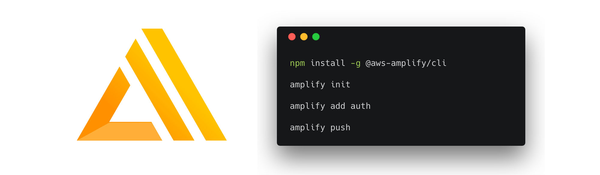

# Building Serverless Web Applications with React and AWS Amplify

In this workshop we'll learn how to build cloud-enabled web applications with GraphQL, React, & [AWS Amplify](https://aws-amplify.github.io/).



### Topics we'll be covering:

- [Authentication](https://github.com/dabit3/aws-amplify-workshop-react#adding-authentication)
- [GraphQL API with AWS AppSync](https://github.com/dabit3/aws-amplify-workshop-react#adding-a-graphql-api)
- [Adding Authorization to the GraphQL API](https://github.com/dabit3/aws-amplify-workshop-react#adding-authorization-to-the-graphql-api)
- [Serverless Functions](https://github.com/dabit3/aws-amplify-workshop-react#adding-a-serverless-function)
- [REST API with a Lambda Function](https://github.com/dabit3/aws-amplify-workshop-react#adding-a-rest-api)
- [Adding Storage with Amazon S3](https://github.com/dabit3/aws-amplify-workshop-react#working-with-storage)
- [Analytics](https://github.com/dabit3/aws-amplify-workshop-react#adding-analytics)
- [Multiple Environments](https://github.com/dabit3/aws-amplify-workshop-react#working-with-multiple-environments)
- [Deploying via the Amplify Console](https://github.com/dabit3/aws-amplify-workshop-react#deploying-via-the-amplify-console)
- [React Native](https://github.com/dabit3/aws-amplify-workshop-react#react-native)
- [Removing / Deleting Services](https://github.com/dabit3/aws-amplify-workshop-react#removing-services)

<!-- ## Redeeming our AWS Credit   
1. Visit the [AWS Console](https://console.aws.amazon.com/console).
2. In the top right corner, click on __My Account__.

3. In the left menu, click __Credits__.
 -->

## Getting Started - Creating the React Application

To get started, we first need to create a new React project & change into the new directory using the [Create React App CLI](https://github.com/facebook/create-react-app).

If you already have this installed, skip to the next step. If not, either install the CLI & create the app or create a new app using npx:

```bash
npm install -g create-react-app
create-react-app my-amplify-app
```

Or use npx (npm 5.2 & later) to create a new app:

```bash
npx create-react-app my-amplify-app
```

Now change into the new app directory & install the AWS Amplify & AWS Amplify React libraries:

```bash
cd my-amplify-app
npm install --save aws-amplify aws-amplify-react uuid
# or
yarn add aws-amplify aws-amplify-react uuid
```

## Installing the CLI & Initializing a new AWS Amplify Project

### Installing the CLI

Next, we'll install the AWS Amplify CLI:

```bash
npm install -g @aws-amplify/cli
```

Now we need to configure the CLI with our credentials:

```js
amplify configure
```

> If you'd like to see a video walkthrough of this configuration process, click [here](https://www.youtube.com/watch?v=fWbM5DLh25U).

Here we'll walk through the `amplify configure` setup. Once you've signed in to the AWS console, continue:
- Specify the AWS Region: __eu-central-1__
- Specify the username of the new IAM user: __amplify-workshop-user__
> In the AWS Console, click __Next: Permissions__, __Next: Tags__, __Next: Review__, & __Create User__ to create the new IAM user. Then, return to the command line & press Enter.
- Enter the access key of the newly created user:   
  accessKeyId: __(<YOUR_ACCESS_KEY_ID>)__   
  secretAccessKey:  __(<YOUR_SECRET_ACCESS_KEY>)__
- Profile Name: __amplify-workshop-user__

### Initializing A New Project

```bash
amplify init
```

- Enter a name for the project: __amplifyreactapp__
- Enter a name for the environment: __dev__
- Choose your default editor: __Visual Studio Code (or your default editor)__   
- Please choose the type of app that you're building __javascript__   
- What javascript framework are you using __react__   
- Source Directory Path: __src__   
- Distribution Directory Path: __build__   
- Build Command: __npm run-script build__   
- Start Command: __npm run-script start__   
- Do you want to use an AWS profile? __Y__
- Please choose the profile you want to use: __amplify-workshop-user__

Now, the AWS Amplify CLI has iniatilized a new project & you will see a new folder: __amplify__ & a new file called `aws-exports.js` in the __src__ directory. These files hold your project configuration.

## Adding Authentication

To add authentication, we can use the following command:

```sh
amplify add auth
```
- Do you want to use default authentication and security configuration?  __Default configuration__
- How do you want users to be able to sign in when using your Cognito User Pool? __Username__
- What attributes are required for signing up? __Email__ (keep default)

Now, we'll run the push command and the cloud resources will be created in our AWS account.

```bash
amplify push
```

To view the service you can run the `console` command the feature you'd like to view:

```sh
amplify console auth
```

### Configuring the React applicaion

Now, our resources are created & we can start using them!

The first thing we need to do is to configure our React application to be aware of our new AWS Amplify project. We can do this by referencing the auto-generated `aws-exports.js` file that is now in our src folder.

To configure the app, open __src/index.js__ and add the following code below the last import:

```js
import Amplify from 'aws-amplify'
import config from './aws-exports'
Amplify.configure(config)
```

Now, our app is ready to start using our AWS services.

### Using the withAuthenticator component

To add authentication, we'll go into __src/App.js__ and first import the `withAuthenticator` HOC (Higher Order Component) from `aws-amplify-react`:

### src/App.js

```js
import { withAuthenticator } from 'aws-amplify-react'
```

Next, we'll wrap our default export (the App component) with the `withAuthenticator` HOC:

```js
export default withAuthenticator(App, { includeGreetings: true })
```

```sh
# run the app

npm start
```

Now, we can run the app and see that an Authentication flow has been added in front of our App component. This flow gives users the ability to sign up & sign in.

> To view the new user that was created in Cognito, go back to the dashboard at [https://console.aws.amazon.com/cognito/](https://console.aws.amazon.com/cognito/). Also be sure that your region is set correctly.

### Accessing User Data

We can access the user's info now that they are signed in by calling `Auth.currentAuthenticatedUser()`.

### src/App.js

```js
import React, { useEffect } from 'react'
import { Auth } from 'aws-amplify'

function App() {
  useEffect(() => {
    Auth.currentAuthenticatedUser()
      .then(user => console.log({ user }))
      .catch(error => console.log({ error }))
  })
  return (
    <div className="App">
      <p>
        Edit <code>src/App.js</code> and save to reload.
      </p>
    </div>
  )
}

export default App
```

### Custom authentication strategies

The `withAuthenticator` component is a really easy way to get up and running with authentication, but in a real-world application we probably want more control over how our form looks & functions.

Let's look at how we might create our own authentication flow.

To get started, we would probably want to create input fields that would hold user input data in the state. For instance when signing up a new user, we would probably need 4 user inputs to capture the user's username, email, password, & phone number.

To do this, we could create some initial state for these values & create an event handler that we could attach to the form inputs:

```js
// initial state
import React, { useReducer } from 'react'

// define initial state
const initialState = {
  username: '', password: '', email: ''
}

// create reducer
function reducer(state, action) {
  switch(action.type) {
    case 'SET_INPUT':
      return { ...state, [action.inputName]: action.inputValue }
    default:
      return state
  }
}

// useReducer hook creates local state
const [state, dispatch] = useReducer(reducer, initialState)

// event handler
function onChange(e) {
  dispatch({
    type: 'SET_INPUT',
    inputName: e.target.name,
    inputValue: e.target.value
  })
}

// example of usage with input
<input
  name='username'
  placeholder='username'
  value={state.username}
  onChange={onChange}
/>
```

We'd also need to have a method that signed up & signed in users. We can us the Auth class to do thi. The Auth class has over 30 methods including things like `signUp`, `signIn`, `confirmSignUp`, `confirmSignIn`, & `forgotPassword`. Thes functions return a promise so they need to be handled asynchronously.

```js
// import the Auth component
import { Auth } from 'aws-amplify'

// Class method to sign up a user
async function signUp() {
  const { username, password, email } = state
  try {
    await Auth.signUp({ username, password, attributes: { email }})
    console.log('user successfully signed up!')
  } catch (err) {
    console.log('error signing up user...', err)
  }
}

<button onClick={signUp}>Sign Up</button>
```

## Adding a GraphQL API

To add a GraphQL API, we can use the following command:

```sh
amplify add api
```

Answer the following questions

- Please select from one of the above mentioned services __GraphQL__   
- Provide API name: __CryptoGraphQL__   
- Choose an authorization type for the API __API key__   
- Do you have an annotated GraphQL schema? __N__   
- Do you want a guided schema creation? __Y__   
- What best describes your project: __Single object with fields (e.g. “Todo” with ID, name, description)__   
- Do you want to edit the schema now? (Y/n) __Y__   

> When prompted, update the schema to the following:   

```graphql
type Coin @model {
  id: ID!
  clientId: ID
  name: String!
  symbol: String!
  price: Float!
}
```

> Next, let's push the configuration to our account:

```bash
amplify push
```

- Do you want to generate code for your newly created GraphQL API __Y__
- Choose the code generation language target: __javascript__
- Enter the file name pattern of graphql queries, mutations and subscriptions: __(src/graphql/**/*.js)__
- Do you want to generate/update all possible GraphQL operations - queries, mutations and subscriptions? __Y__
- Enter maximum statement depth [increase from default if your schema is deeply nested] __2__

To view the service you can run the `console` command the feature you'd like to view:

```sh
amplify console api
```

### Adding mutations from within the AWS AppSync Console

In the AWS AppSync console, open your API & then click on Queries.

Execute the following mutation to create a new coin in the API:

```graphql
mutation createCoin {
  createCoin(input: {
    name: "Bitcoin"
    symbol: "BTC"
    price: 9000
  }) {
    id name symbol price
  }
}
```

Now, let's query for the coin:

```graphql
query listCoins {
  listCoins {
    items {
      id
      name
      symbol
      price
    }
  }
}
```

We can even add search / filter capabilities when querying:

```graphql
query listCoins {
  listCoins(filter: {
    price: {
      gt: 2000
    }
  }) {
    items {
      id
      name
      symbol
      price
    }
  }
}
```

### Interacting with the GraphQL API from our client application - Querying for data

Now that the GraphQL API is created we can begin interacting with it!

The first thing we'll do is perform a query to fetch data from our API.

To do so, we need to define the query, execute the query, store the data in our state, then list the items in our UI.

### src/App.js

```js
// src/App.js
import React, { useEffect, useState } from 'react'

// imports from Amplify library
import { API, graphqlOperation } from 'aws-amplify'
import { withAuthenticator } from 'aws-amplify-react'

// import query
import { listCoins } from './graphql/queries'

function App() {
  const [coins, updateCoins] = useState([])

  useEffect(() => {
    getData()
  }, [])

  async function getData() {
    try {
      const coinData = await API.graphql(graphqlOperation(listCoins))
      console.log('data from API: ', coinData)
      updateCoins(coinData.data.listCoins.items)
    } catch (err) {
      console.log('error fetching data..', err)
    }
  }

  return (
    <div>
      {
        coins.map((c, i) => (
          <div key={i}>
            <h2>{c.name}</h2>
            <h4>{c.symbol}</h4>
            <p>{c.price}</p>
          </div>
        ))
      }
    </div>
  )
}

export default withAuthenticator(App, { includeGreetings: true })
```

## Performing mutations

 Now, let's look at how we can create mutations. Let's change the component to use a `useReducer` hook.

```js
// src/App.js
import React, { useEffect, useReducer } from 'react'
import { API, graphqlOperation } from 'aws-amplify'
import { withAuthenticator } from 'aws-amplify-react'
import { listCoins } from './graphql/queries'
import { createCoin as CreateCoin } from './graphql/mutations'

// import uuid to create a unique client ID
import uuid from 'uuid/v4'

const CLIENT_ID = uuid()

// create initial state
const initialState = {
  name: '', price: '', symbol: '', coins: []
}

// create reducer to update state
function reducer(state, action) {
  switch(action.type) {
    case 'SETCOINS':
      return { ...state, coins: action.coins }
    case 'SETINPUT':
      return { ...state, [action.key]: action.value }
    default:
      return state
  }
}

function App() {
  const [state, dispatch] = useReducer(reducer, initialState)

  useEffect(() => {
    getData()
  }, [])

  async function getData() {
    try {
      const coinData = await API.graphql(graphqlOperation(listCoins))
      console.log('data from API: ', coinData)
      dispatch({ type: 'SETCOINS', coins: coinData.data.listCoins.items})
    } catch (err) {
      console.log('error fetching data..', err)
    }
  }

  async function createCoin() {
    const { name, price, symbol } = state
    if (name === '' || price === '' || symbol === '') return
    const coin = {
      name, price: parseFloat(price), symbol, clientId: CLIENT_ID
    }
    const coins = [...state.coins, coin]
    dispatch({ type: 'SETCOINS', coins })
    console.log('coin:', coin)
    
    try {
      await API.graphql(graphqlOperation(CreateCoin, { input: coin }))
      console.log('item created!')
    } catch (err) {
      console.log('error creating coin...', err)
    }
  }

  // change state then user types into input
  function onChange(e) {
    dispatch({ type: 'SETINPUT', key: e.target.name, value: e.target.value })
  }

  // add UI with event handlers to manage user input
  return (
    <div>
      <input
        name='name'
        placeholder='name'
        onChange={onChange}
        value={state.name}
      />
      <input
        name='price'
        placeholder='price'
        onChange={onChange}
        value={state.price}
      />
      <input
        name='symbol'
        placeholder='symbol'
        onChange={onChange}
        value={state.symbol}
      />
      <button onClick={createCoin}>Create Coin</button>
      {
        state.coins.map((c, i) => (
          <div key={i}>
            <h2>{c.name}</h2>
            <h4>{c.symbol}</h4>
            <p>{c.price}</p>
          </div>
        ))
      }
    </div>
  )
}

export default withAuthenticator(App, { includeGreetings: true })
```

### GraphQL Subscriptions

Next, let's see how we can create a subscription to subscribe to changes of data in our API.

To do so, we need to define the subscription, listen for the subscription, & update the state whenever a new piece of data comes in through the subscription.

```js
// import the subscription
import { onCreateCoin } from './graphql/subscriptions'

// update reducer
function reducer(state, action) {
  switch(action.type) {
    case 'SETCOINS':
      return { ...state, coins: action.coins }
    case 'SETINPUT':
      return { ...state, [action.key]: action.value }
    // new 👇
    case 'ADDCOIN':
      return { ...state, coins: [...state.coins, action.coin] }
    default:
      return state
  }
}

// subscribe in useEffect
useEffect(() => {
  const subscription = API.graphql(graphqlOperation(onCreateCoin)).subscribe({
      next: (eventData) => {
        const coin = eventData.value.data.onCreateCoin
        if (coin.clientId === CLIENT_ID) return
        dispatch({ type: 'ADDCOIN', coin  })
      }
  })
  return () => subscription.unsubscribe()
}, [])
```

## Adding Authorization to the GraphQL API

To add authorization to the API, we can re-configure the API to use our cognito identity pool. To do so, we can run `amplify configure api`:

```sh
amplify configure api
```

- Please select from one of the below mentioned services: __GraphQL__
- Choose an authorization type for the API: __Amazon Cognito User Pool__

Next, we'll run `amplify push`:

```sh
amplify push
```

- Do you want to update code for your updated GraphQL API __N__

Now, we can only access the API with a logged in user.

### Adding fine-grained access controls to the GraphQL API

Next, let's add a field that can only be accessed by the current user.

To do so, we'll update the schema to add the following new type below the existing Coin type:

```graphql
type Note @model @auth(rules: [{allow: owner}]) {
  id: ID!
  title: String!
  description: String
}
```

Next, we'll deploy the updates to our API:

```sh
amplify push
```

- Do you want to update code for your updated GraphQL API: __Y__
- Do you want to generate GraphQL statements (queries, mutations and subscription) based on your schema types? __Y__

Now, the operations associated with this field will only be accessible by the creator of the item.

To test it out, try creating a new user & accessing a note from another user.

To test the API out in the AWS AppSync console, it will ask for you to __Login with User Pools__. The form will ask you for a __ClientId__. This __ClientId__ is located in __src/aws-exports.js__ in the `aws_user_pools_web_client_id` field.

## Adding a Serverless Function

### Adding a basic Lambda Function

To add a serverless function, we can run the following command:

```sh
amplify add function
```

> Answer the following questions

- Provide a friendly name for your resource to be used as a label for this category in the project: __basiclambda__
- Provide the AWS Lambda function name: __basiclambda__
- Choose the function template that you want to use: __Hello world function__
- Do you want to edit the local lambda function now? __Y__

> This should open the function package located at __amplify/backend/function/basiclambda/src/index.js__.

Edit the function to look like this, & then save the file.

```js
exports.handler = function (event, context) {
  console.log('event: ', event)
  const body = {
    message: "Hello world!"
  }
  const response = {
    statusCode: 200,
    body
  }
  context.done(null, response);
}
```

Next, we can test this out by running:

```sh
amplify function invoke basiclambda
```

- Provide the name of the script file that contains your handler function: __index.js__
-  Provide the name of the handler function to invoke: __handler__

You'll notice the following output from your terminal:

```sh
Running "lambda_invoke:default" (lambda_invoke) task

event:  { key1: 'value1', key2: 'value2', key3: 'value3' }

Success!  Message:
------------------
{"statusCode":200,"body":{"message":"Hello world!"}}

Done.
Done running invoke function.
```

_Where is the event data coming from? It is coming from the values located in event.json in the function folder (__amplify/backend/function/basiclambda/src/event.json__). If you update the values here, you can simulate data coming arguments the event._

Feel free to test out the function by updating `event.json` with data of your own.

### Adding a function running an express server

Next, we'll build a function that will be running an [Express](https://expressjs.com/) server inside of it.

This new function will fetch data from a cryptocurrency API & return the values in the response.

To get started, we'll create a new function:

```sh
amplify add function
```

> Answer the following questions

- Provide a friendly name for your resource to be used as a label for this category in the project: __cryptofunction__
- Provide the AWS Lambda function name: __cryptofunction__
- Choose the function template that you want to use: __Serverless express function (Integration with Amazon API Gateway)__
- Do you want to edit the local lambda function now? __Y__

> This should open the function package located at __amplify/backend/function/cryptofunction/src/index.js__.

Here, we'll add the following code & save the file:

```js
app.use(function(req, res, next) {
  res.header("Access-Control-Allow-Origin", "*")
  res.header("Access-Control-Allow-Headers", "Origin, X-Requested-With, Content-Type, Accept")
  next()
});
// below the last app.use() method, add the following code 👇
const axios = require('axios')

app.get('/coins', function(req, res) {
  let apiUrl = `https://api.coinlore.com/api/tickers?start=0&limit=10`
  
  if (req.apiGateway && req.apiGateway.event.queryStringParameters) {
    const { start = 0, limit = 10 } = req.apiGateway.event.queryStringParameters
    apiUrl = `https://api.coinlore.com/api/tickers/?start=${start}&limit=${limit}`
  }
  axios.get(apiUrl)
    .then(response => {
      res.json({
        coins: response.data.data
      })
    })
    .catch(err => res.json({ error: err }))
})
```

Next, we'll install axios in the function package:

```sh
cd amplify/backend/function/cryptofunction/src

npm install axios
```

Next, change back into the root directory.

Now we can test this function out:

```sh
amplify function invoke cryptofunction
```

This will start up the node server. We can then make `curl` requests agains the endpoint:

```sh
curl 'localhost:3000/coins'
```

If we'd like to test out the query parameters, we can update the __event.json__ to add the following:

```json
{
    "httpMethod": "GET",
    "path": "/coins",
    "queryStringParameters": {
        "start": "0",
        "limit": "1"
    }
}
```

When we invoke the function these query parameters will be passed in & the http request will be made immediately.

## Adding a REST API

Now that we've created the cryptocurrency Lambda function let's add an API endpoint so we can invoke it via http.

To add the REST API, we can use the following command:

```sh
amplify add api
```

> Answer the following questions

- Please select from one of the above mentioned services __REST__   
- Provide a friendly name for your resource that will be used to label this category in the project: __cryptoapi__   
- Provide a path, e.g. /items __/coins__   
- Choose lambda source __Use a Lambda function already added in the current Amplify project__   
- Choose the Lambda function to invoke by this path: __cryptofunction__   
- Restrict API access __Y__
- Who should have access? __Authenticated users only__
- What kind of access do you want for Authenticated users __read/create/update/delete__
- Do you want to add another path? (y/N) __N__     

Now the resources have been created & configured & we can push them to our account: 

```bash
amplify push
```

### Interacting with the new API

Now that the API is created we can start sending requests to it & interacting with it.

Let's request some data from the API:

```js
// src/App.js
import React, { useEffect, useState } from 'react'
import { API } from 'aws-amplify'
import { withAuthenticator } from 'aws-amplify-react'

function App() {
  const [coins, updateCoins] = useState([])

  async function getData() {
    try {
      // const data = await API.get('cryptoapi', '/coins')
      const data = await API.get('cryptoapi', '/coins?limit=5&start=100')
      console.log('data from Lambda REST API: ', data)
      updateCoins(data.coins)
    } catch (err) {
      console.log('error fetching data..', err)
    }
  }

  useEffect(() => {
    getData()
  }, [])

  return (
    <div>
      {
        coins.map((c, i) => (
          <div key={i}>
            <h2>{c.name}</h2>
            <p>{c.price_usd}</p>
          </div>
        ))
      }
    </div>
  )
}

export default withAuthenticator(App, { includeGreetings: true })
```

#### Challenge

Refactor the above component to use `useReducer` instead of `useState` to add an additional `loading` parameter to the initial state to indicate that the app is fetching and loading when launched.

## Working with Storage

To add storage, we can use the following command:

```sh
amplify add storage
```

> Answer the following questions   

- Please select from one of the below mentioned services __Content (Images, audio, video, etc.)__
- Please provide a friendly name for your resource that will be used to label this category in the
 project: __YOURAPINAME__
- Please provide bucket name: __YOURUNIQUEBUCKETNAME__
- Who should have access: __Auth users only__
- What kind of access do you want for Authenticated users __read/write__   


```sh
amplify push
```

Now, storage is configured & ready to use.

What we've done above is created configured an Amazon S3 bucket that we can now start using for storing items.

For example, if we wanted to test it out we could store some text in a file like this:

```js
import { Storage } from 'aws-amplify'

// create function to work with Storage
function addToStorage() {
  await Storage.put('javascript/MyReactComponent.js', `
    import React from 'react'
    const App = () => (
      <p>Hello World</p>
    )
    export default App
  `)
  console.log('data stored in S3!')
}

// add click handler
<button onClick={addToStorage}>Add To Storage</button>
```

This would create a folder called `javascript` in our S3 bucket & store a file called __MyReactComponent.js__ there with the code we specified in the second argument of `Storage.put`.

To view the service you can run the `console` command the feature you'd like to view:

```sh
amplify console analytics
```

If we want to read everything from this folder, we can use `Storage.list`:

```js
readFromStorage() {
  const data = Storage.list('javascript/')
  console.log('data from S3: ', data)
}
```

If we only want to read the single file, we can use `Storage.get`:

```js
readFromStorage() {
  const data = Storage.get('javascript/MyReactComponent.js')
  console.log('data from S3: ', data)
}
```

If we wanted to pull down everything, we can use `Storage.list`:

```js
function readFromStorage() {
  const data = Storage.list('')
  console.log('data from S3: ', data)
}
```

### Working with images

Here's how you can store an image:

```js
function App() {
  async function onChange(e) {
    const file = e.target.files[0];
    await Storage.put('example.png', file)
    console.log('image successfully stored!')
  }

  return (
    <input
      type="file" accept='image'
      onChange={(e) => this.onChange(e)}
    />
  )
}
```

Here's how you can read and display an image:

```js
import React, { useState } from 'react'

function App() {
  const [imageUrl, updateImage] = useState('')

  async function fetchImage() {
    const imagePath = await Storage.get('example.png')
    updateImage(imagePath)
  }

  return (
    <div>
      
      <button onClick={fetchImage}>Fetch Image</button>
    </div>
  )
}
```

We can even use the S3Album component, one of a few components in the AWS Amplify React library to create a pre-configured photo picker:

```js
import { S3Album, withAuthenticator } from 'aws-amplify-react'

function App() {
  return (
    <div className="App">
      <S3Album path={''} picker />
    </div>
  );
}
```

## Adding Analytics

To add analytics, we can use the following command:

```sh
amplify add analytics
```

> Next, we'll be prompted for the following:

- Provide your pinpoint resource name: __amplifyanalytics__   
- Apps need authorization to send analytics events. Do you want to allow guest/unauthenticated users to send analytics events (recommended when getting started)? __Y__   
- overwrite YOURFILEPATH-cloudformation-template.yml __Y__

### Recording events

Now that the service has been created we can now begin recording events.

To record analytics events, we need to import the `Analytics` class from Amplify & then call `Analytics.record`:

```js
import { Analytics } from 'aws-amplify'

state = {username: ''}

async componentDidMount() {
  try {
    const user = await Auth.currentAuthenticatedUser()
    this.setState({ username: user.username })
  } catch (err) {
    console.log('error getting user: ', err)
  }
}

recordEvent = () => {
  Analytics.record({
    name: 'My test event',
    attributes: {
      username: this.state.username
    }
  })
}

<button onClick={this.recordEvent}>Record Event</button>
```

## Working with multiple environments

You can create multiple environments for your application in which to create & test out new features without affecting the main environment which you are working on.

When you create a new environment from an existing environment, you are given a copy of the entire backend application stack from the original project. When you make changes in the new environment, you are then able to test these new changes in the new environment & merge only the changes that have been made since the new environment was created back into the original environment.

Let's take a look at how to create a new environment. In this new environment, we'll re-configure the GraphQL Schema to have another field for the coin rank.

First, we'll initialize a new environment using `amplify env add`:

```sh
amplify env add

> Do you want to use an existing environment? No
> Enter a name for the environment: apiupdate
> Do you want to use an AWS profile? Y
> Please choose the profile you want to use: amplify-workshop-profile
```

Once the new environment is initialized, we should be able to see some information about our environment setup by running:

```sh
amplify env list

| Environments |
| ------------ |
| dev          |
| *apiupdate   |
```

Now we can update the GraphQL Schema in `amplify/backend/api/CryptoGraphQL/schema.graphql` to the following (adding the `rank` field):

```graphql
type Coin {
	id: ID!
	clientId: ID
	name: String!
	symbol: String!
	price: Float!
  rank: Int
}
```

Now, we can create this new stack by running `amplify push`:

```sh
amplify push
```

After we test it out, we can now merge it into our original local environment:

```sh
amplify env checkout local
```

Next, run the `status` command:

```sh
amplify status
```

You should now see an __Update__ operation:

```sh
Current Environment: local

| Category | Resource name   | Operation | Provider plugin   |
| -------- | --------------- | --------- | ----------------- |
| Api      | CryptoGraphQL   | Update    | awscloudformation |
| Auth     | cognito75a8ccb4 | No Change | awscloudformation |
```

To deploy the changes, run the push command:

```sh
amplify push
```

- Do you want to update code for your updated GraphQL API? __Y__
- Do you want to generate GraphQL statements? __Y__

Now, the changes have been deployed & we can delete the apiupdate environment:

```sh
amplify env remove apiupdate

Do you also want to remove all the resources of the environment from the cloud? Y
```

Now, we should be able to run the `list` command & see only our main environment:

```sh
amplify env list
```

## Deploying via the Amplify Console

For hosting, we can use the [Amplify Console](https://aws.amazon.com/amplify/console/) to deploy the application.

The first thing we need to do is [create a new GitHub repo](https://github.com/new) for this project. Once we've created the repo, we'll copy the URL for the project to the clipboard & initialize git in our local project:

```sh
git init

git remote add origin git@github.com:username/project-name.git

git add .

git commit -m 'initial commit'

git push origin master
```

Next we'll visit the Amplify Console in our AWS account at [https://eu-west-1.console.aws.amazon.com/amplify/home](https://eu-west-1.console.aws.amazon.com/amplify/home).

Here, we'll click __Get Started__ to create a new deployment. Next, authorize Github as the repository service.

Next, we'll choose the new repository & branch for the project we just created & click __Next__.

In the next screen, we'll create a new role & use this role to allow the Amplify Console to deploy these resources & click __Next__.

Finally, we can click __Save and Deploy__ to deploy our application!

Now, we can push updates to Master to update our application.

## React Native

AWS Amplify also has framework support for [React Native](https://aws-amplify.github.io/docs/js/start?platform=react-native).

To get started with using AWS Amplify with React Native, we'll need to install the __AWS Amplify React Native__ package & then link the dependencies.

```sh
npm install aws-amplify-react-native

# If using Expo, you do not need to link these two libraries as they are both part of the Expo SDK.
react-native link amazon-cognito-identity-js
react-native link react-native-vector-icons
```

Implementing features with AWS Amplify in React Native is the same as the features implemented in the other steps of this workshop. The only difference is that you will be working with React Native primitives vs HTML elements.

## Removing Services

If at any time, or at the end of this workshop, you would like to delete a service from your project & your account, you can do this by running the `amplify remove` command:

```sh
amplify remove auth

amplify push
```

If you are unsure of what services you have enabled at any time, you can run the `amplify status` command:

```sh
amplify status
```

`amplify status` will give you the list of resources that are currently enabled in your app.

## Deleting entire project

```sh
amplify delete
```
